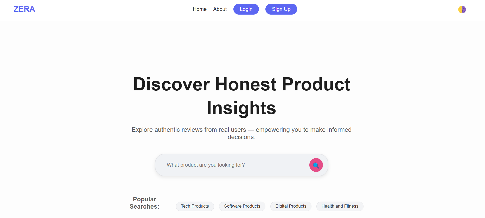

# 🌟 ZERA Platform

The **ZERA Platform** is a web-based product review ecosystem that connects companies seeking authentic product feedback with students and individuals who earn rewards for sharing thoughtful, structured reviews. The platform emphasizes data security, transparency, and fair compensation — bridging the gap between innovation and user experience.

---

## 📌 Table of Contents
- [Live Demo](#live-demo)
- [Overview](#overview)
- [Features](#features)
- [Technology Stack](#technology-stack)
- [Setup Instructions](#setup-instructions)
- [Usage](#usage)
- [Current Status](#current-status)
- [Contributors](#contributors)
- [Related Projects](#related-projects)
- [License](#license)
- [Resources](#resources)

---

## 🌐 Live Demo

🔗 [Deployed Site](https://victorcreativee.github.io/zera-landing-page/)

📖 [Final Project Blog Article](https://www.linkedin.com/pulse/building-zera-student-powered-product-review-victor-tuyizere-ym9of)

👤 [LinkedIn - Victor Tuyizere](https://www.linkedin.com/pulse/building-zera-student-powered-product-review-victor-tuyizere-ym9of)

---

## 📸 Screenshot



> _Landing page showcasing trending products and user interaction._

---

## 🧠 Overview

The **ZERA Platform** is a web application designed to connect companies seeking product feedback with students and individuals who can earn by providing honest reviews. It enables:
- Companies to post products and gather actionable feedback.
- Users to test products and earn money based on review quality.
- Admins to manage companies and platform activities.

---

## ✨ Features

- 🔐 **JWT Authentication** for secure login and role-based access
- 📦 **Product Submission System** for companies
- 📝 **Review Submission & Management** with real-time rating
- 💰 **Wallet Page** displaying points and earnings
- 💳 **Secure Payments** via Stripe or PayPal *(planned)*
- 🧑‍💼 **Admin Dashboard** for approving companies and managing reviews
- 🌐 **Public Landing Page** with trending product highlights
- 🌟 **User Profile Pages** with stats and review history

---

## 🧰 Technology Stack

- **Backend:** Flask (Python)
- **Frontend:** HTML, CSS, Bootstrap, JavaScript
- **Database:** SQLite (dev), PostgreSQL / MySQL (prod-ready)
- **Version Control:** Git & GitHub
- **Deployment:** GitHub Pages (for landing) or Vercel/Render *(optional)*

---

## ⚙️ Setup Instructions

### 1. Clone the Repository
```bash
git clone https://github.com/victorcreativee/Zera-platform.git
cd Zera-platform

